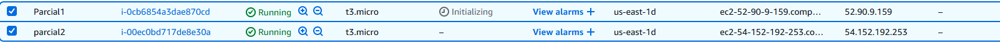
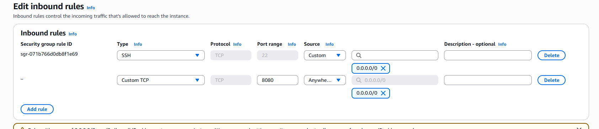
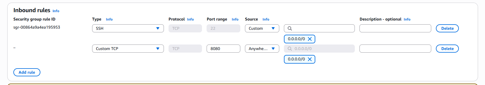
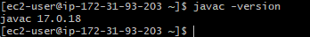
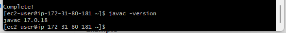
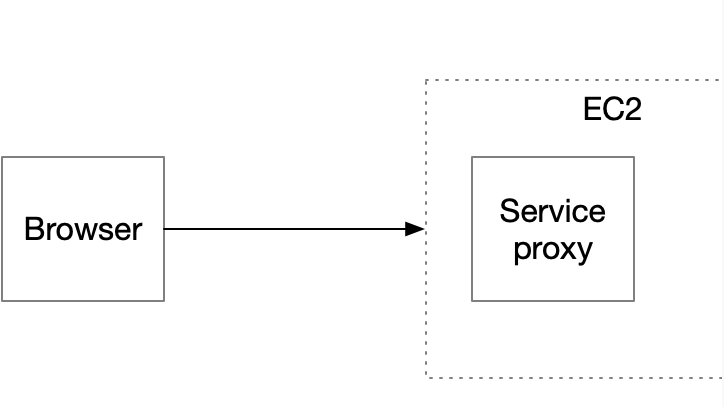
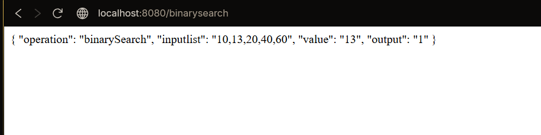
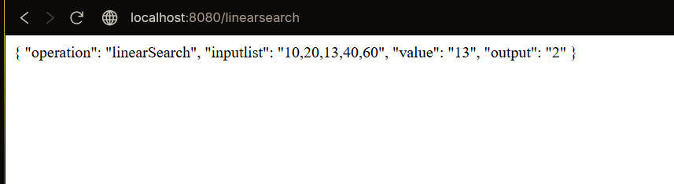
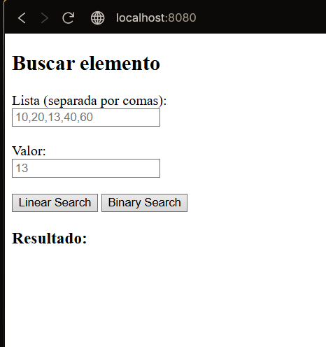

# parcialTDSE
Se debe de hacer una aplicacion we en la que tenemos dos servicios, uno de busqueda lineal y otro de busqueda binaria
Por lo que tenemos que tener el servicio de busqueda que es en el que vamos a trabajar las request del user

Instancias creadas em AWS

Apertura de puertos

Apertura de puertos de la segunda instancia

Instalacaion de linux a las instancias
- Primera instancia
- 
- segunda instancia
- 

Ahora lo que debemos de haceer es implementar el proxyController y el proxyService
Para poder hacer el llamado de las busquedas con la solicitud del cliente

Servicio a construir:

Pruebas:

- Autor: **Diego Alejandro Rozo Gaviria**